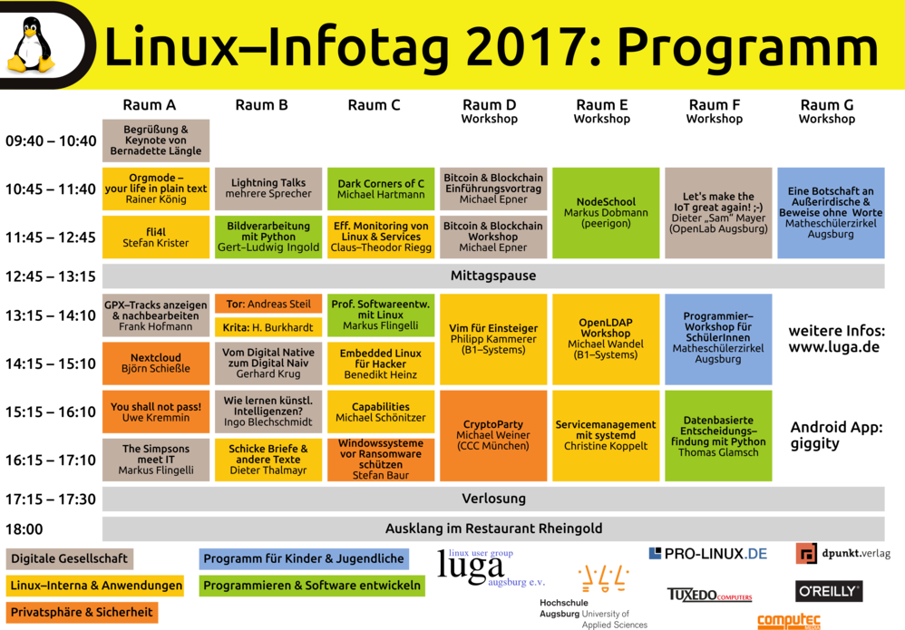
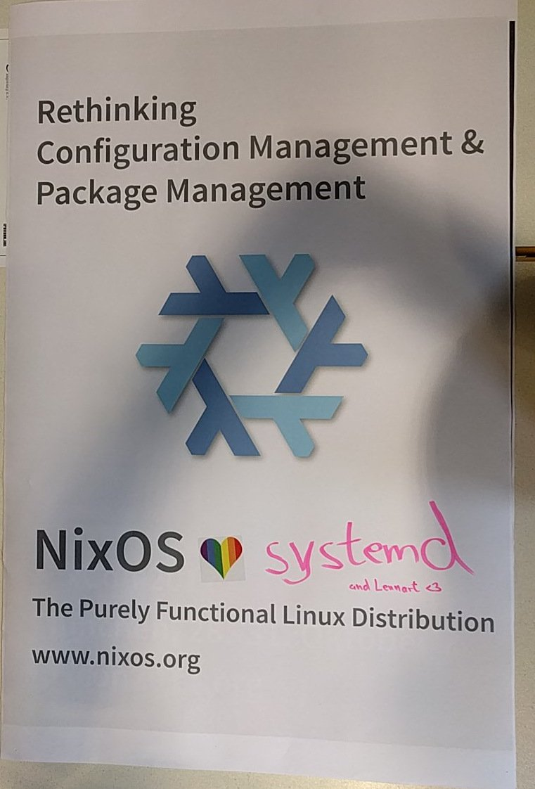

---
title: NixOS at the Linux Infotag
subtitle: A Short Retrospective
tags: [nixos]
date: 2017-04-28
...

Last week [Linux Infotag Augsburg](https://www.luga.de/Aktionen/LIT-2017/)
(“Linux Info Day”) happened at Hochschule Augsburg, co-organized
by [Ingo Blechschmidt](https://www.speicherleck.de/) and the
wonderful [Christine Koppelt](https://twitter.com/ckoppelt).

Like last year and the year before, a NixOS booth was organized
by [\@aszlig](https://github.com/aszlig) and I. (Actually, two years ago I
wasn’t even on NixOS yet and it was [\@goibhniu](https://twitter.com/goibhniu)
and aszlig who taught me about it at LIT. So, yes, LIT and NixOS have a history,
at least for me.)

We shared a table with [OpenLab Augsburg](https://openlab-augsburg.de/), the
local hackerspace. Over the day and between talks lots of people stopped and
asked questions, and we happily explained everything they wanted to know.

“Between talks” means one of six parallel tracks, which is pretty awesome for a
local OSS event.

{height=400 alt=}

### `services.desktopManager.gnome3.enable = true;`

One of my personal highlights was when I explained the nixos configuration
system to two elderly Unix users and spontaneously got the idea to switch the
config of my laptop from `xmonad` to `gnome3`. I started the `nixos rebuild
switch` while continuing to explain. Five minutes and a `systemctl restart
display-manager.target` later, the baffled audience was greeted with a pretty
bare but working GNOME 3. Awesome.

### Suddenly, interview

Some guy with a portable microphone came to our desk. Turns out he was very
interested in hearing more about NixOS. So we talked for an hour.

Let’s see when and how that will appear
on [/dev/radio](http://ulm.ccc.de/dev/radio). It’s in German, though.

### We <3 systemd

We also did some advertising. I suspect it triggered some people.

{height=600}

<footer>
All pictures by [\@lit_augsburg](https://twitter.com/lit_augsburg).
</footer>
